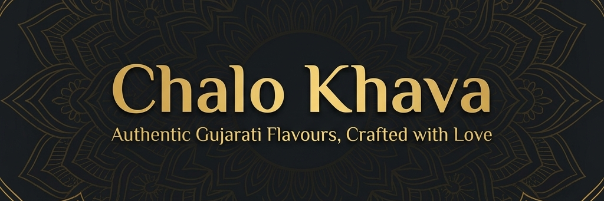

<p >
  
</p>

# 🍴 Chalo Khava | ચાલો ખાવા

> **Surat's Favourite Restaurant — A Premium Restaurant Website**  
> *Authentic Gujarati flavours, crafted with love since 2010.*

---

## 🌟 About the Project

**Chalo Khava** is a fully responsive, single-page restaurant website built for a traditional Gujarati & multi-cuisine restaurant based in Surat, Gujarat. The project showcases a modern, premium web presence for a local restaurant — combining rich Indian aesthetics with smooth, performance-first web design.

The site features everything a real restaurant needs online: a dynamic menu with category filters, a table reservation form, a photo gallery, customer testimonials, live social links, and a Google Maps embed — all in one beautifully crafted page.

---

## ✨ Features

- 📢 **Announcement Bar** — Scrolling daily specials and contact info
- 🧭 **Sticky Navbar** — Smooth scroll navigation with mobile hamburger menu
- 🎯 **Hero Section** — Full-screen landing with animated stats counter 
- 🖼️ **Gallery** — CSS grid photo gallery with hover overlay effects
- 🍛 **Interactive Menu** — Dynamic JS-rendered menu cards with category filter buttons (Gujarati Specials, Starters, Mains, Breads, Desserts, Beverages)
- ⭐ **Special Banner** — Highlighted Gujarati Thali deal 
- 💬 **Testimonials Slider** — Auto-rotating guest reviews with dot navigation
- 📋 **Reservation Form** — Table booking with name, phone, date, time, guests & special requests
- 📍 **Contact Section** — Address, phone, email, hours, Google Maps embed
- 📱 **Social Links** — Instagram & WhatsApp integration
- 🔝 **Back to Top Button** + floating WhatsApp button
- 🔔 **Toast Notifications** — Form submission feedback
- 📱 **Fully Responsive** — Mobile-first design, works on all screen sizes

---

## 🛠️ Tech Stack

| Technology | Usage |
|---|---|
| **HTML5** | Semantic page structure |
| **CSS3** | Custom styling, animations, grid & flexbox layouts |
| **Vanilla JavaScript** | Menu rendering, filters, slider, form validation, scroll effects |
| **Google Fonts** | Playfair Display · Poppins · Dancing Script |
| **Google Maps Embed** | Restaurant location |

> No frameworks. No dependencies. Pure HTML, CSS & JS — fast and lightweight.

---

## 📁 Project Structure

```
PROJECT1/
├── index.html        # Main single-page website
├── css/
│   └── style.css     # All styles (~35KB)
├── js/
│   └── main.js       # All interactivity (~33KB)
├── images/
│   └── logo.png      # Restaurant logo
└── README.md
```

---

## 🚀 Getting Started

No build tools or installation needed.
Just clone the repo and run it on the browser

### Option 1 — Open directly
```bash
# Clone the repo
git clone https://github.com/Rudra-7127/PROJECT1.git

# Open in browser
cd PROJECT1
start index.html
```

### Option 2 — Live Server (VS Code)
1. Install the **Live Server** extension in VS Code
2. Right-click `index.html` → **Open with Live Server**
3. Site opens at `http://127.0.0.1:5500`

---

## 📸 Sections Overview

| Section | Description |
|---|---|
| Hero | Full-screen welcome with animated counters |
| About | Our story, 3-generation recipes, values |
| Gallery | Food & ambiance photo grid |
| Special Banner | Chef's Special Gujarati Thali – ₹399 |
| Menu | Filterable dish cards with modal popup |
| Testimonials | Sliding guest reviews |
| Contact | Info cards, map, reservation form |
| Footer | Quick links, Instagram grid, social |

---


## 📄 License

This project is open-source and available under the [MIT License](LICENSE).

---


## 👨‍💻 Developer

**Rudra J Rabadiya**  
GitHub: [Rudra-7127](https://github.com/Rudra-7127)  
Instagram: [@rudra.rabadiya.07](https://www.instagram.com/rudra.rabadiya.07/)

---

